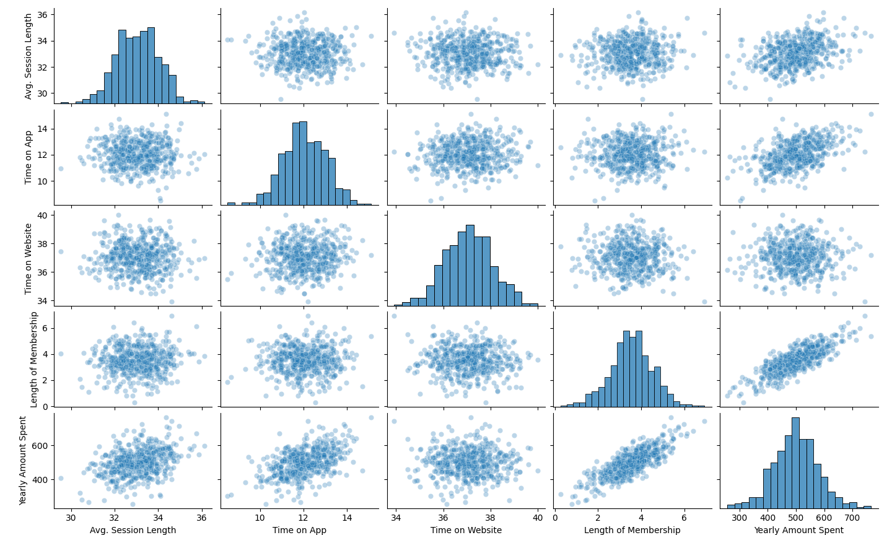

## Project : Multiple Linear Regression E-commerce

### Table of contents :

1. Problem statement
2. Compatible configurations.
3. Installing packages.
4. Steps.
5. Conclusion

## 1. Problem statement :

This dataset is having data of customers who buys clothes online.
The store offers in-store style and clothing advice sessions. Customers come in to the store,
have sessions/meetings with a personal stylist, then they can go home and order either on a
mobile app or website for the clothes they want.
The company is trying to decide whether to focus their efforts on their mobile app experience or 
their website.

## 2. Compatible configurations :

* Python 3
* Windows 10
* MacOS
* Linux

## 3. Installing packages :
This program uses the following Python libraries :

```
contourpy 1.2.0
cycler 0.12.1
fonttools 4.47.0
joblib 1.3.2
kiwisolver 1.4.5
matplotlib 3.8.2
numpy 1.26.2
packaging 23.2
pandas 2.1.4
Pillow 10.1.0
pyparsing 3.1.1
python-dateutil 2.8.2
pytz 2023.3.post1
scikit-learn 1.3.2
scipy 1.11.4
seaborn 0.13.0
six 1.16.0
threadpoolctl 3.2.0
tzdata 2023.3

```

## 4. Steps :

### The different steps to build a Linear Regression Model : 

  * Loading the data
  * Viewing the data
  * E.D.A : Exploratory Data Analysis
  * Data splitting into training and testing sets
  * Creating a Linear Regression model
  * Model Fitting
  * Prediction
  * Evaluation of the model with metrics
  * Residual analysis of the training data

## 5. Conclusion :

  * Given the metrics obtained (MAE, MSE and RMSE) compared to the range of the dependant variable
(Yearly Amount Spent) and the histogram of the residual which looks normally distributed, 
we can affirm that the model has a pretty high accuracy.
  * Moreover based on the model coefficients, we can conclude that the company should focus more
their efforts on their mobile app experience.

---